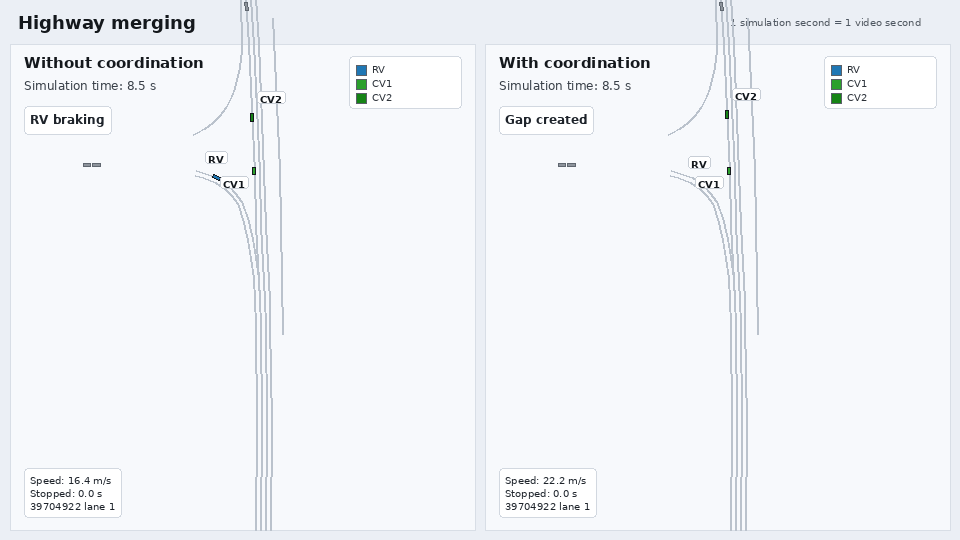
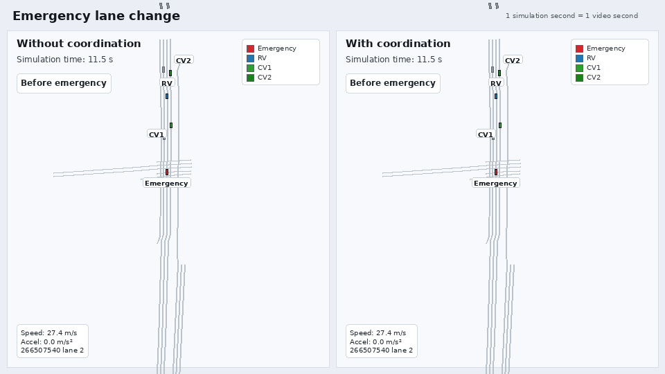

# Priority-Based Maneuver Coordination in Artery


This repository provides a functioning research implementation of decentralized V2X maneuver coordination for connected and automated vehicles using Artery, OMNeT++, INET, Vanetza, SUMO, and TraCI. It supports cooperative merging and safety-critical lane-change validation scenarios, including negotiation, execution, retry, fallback, diagnostics, runtime configuration, and simulation-level regression tests.

The implementation is complete for its stated validation scope. It is not a production controller or a map-independent maneuver-planning framework; its scenario and geometry assumptions are documented under [Current Scope and Limitations](#current-scope-and-limitations).

## Key Capabilities

- Requesting Vehicle (RV), Cooperating Vehicle (CV), and Non-Cooperating Vehicle (NCV) roles.
- One-CV and two-CV priority-aware negotiation using Request, Offer, Confirm, Accept, and Reject.
- Initial and repeated Execute messages in `ManeuverExecutionContainer`.
- Emergency execution signaling using `EmergencyPriority` plus Abort.
- Retry, timeout, second-Request, cooperation-cost, and priority-decision logic.
- Separate requested, selected, negotiated, and rolling live trajectory state.
- Typed runtime configuration read and validated by `McService`.
- SUMO/TraCI execution control for the supplied merging and lane-change scenarios.
- Stable diagnostics and five full-simulation regression tests.

## Supported Scenarios

### Medium-Priority Cooperative Merging

A configured merging vehicle becomes the RV in the validation maneuver area. It selects one or two highway-lane CVs from current trajectory and gap information, negotiates using Request, Offer, Confirm, and Accept, and then sends execution-container Execute messages. Physical actuation and safe restoration use scenario-configured values.

Primary configuration: `envmod-19CAVs-merging`.

### High-Priority Safety-Critical Lane Change

An emergency source sends an execution-container Abort with `EmergencyPriority`. A qualified follower plans and negotiates a lane change with one or two target-lane CVs. Execution applies the configured incremental lateral movement. Active lane-change safety and fallback thresholds are intentionally separate from generic post-execution restoration safety.

Primary configuration: `envmod-19CAVs-emergency-lane-change`.

### Baselines and Second Request

- `envmod-19CAVs-merging-baseline`: equivalent traffic without maneuver coordination.
- `envmod-19CAVs-emergency-lane-change-baseline`: emergency-source braking with coordination transmission suppressed.
- `envmod-19CAVs-second-request-smoke`: forces the first high-priority Request to be rejected, verifies a replacement proposal with a new request ID, and confirms that the final cooperation and execution use that identity.

Station IDs asserted by the tests are deterministic fixtures of the supplied routes, not general protocol assignments.

## Scenario Animations

The animations compare coordinated and matching baseline runs using the same SUMO network, routes, traffic, simulation step, and random seed. They are deterministic replays, not statistical evaluations.

### Cooperative Merging



The baseline is shown on the left and the coordinated run on the right. In the illustrated run, coordination creates a usable gap and allows the merging vehicle to enter without stopping.

[Presentation close-up](docs/media/merging-comparison-presentation-closeup.gif) · [Maneuver close-up](docs/media/merging-comparison-closeup.gif) · [Scenario overview](docs/media/merging-comparison.gif)

### Safety-Critical Lane Change



The emergency vehicle brakes at the same time in both panels. The coordinated run adds high-priority lane-change negotiation and target-lane cooperation.

[Presentation close-up](docs/media/lane-change-comparison-presentation-closeup.gif) · [Maneuver close-up](docs/media/lane-change-comparison-closeup.gif) · [Scenario overview](docs/media/lane-change-comparison.gif)

The presentation close-ups are tighter, presentation-focused views generated from the same captured simulation data.

The capture and analysis workflow is documented in [tools/animation/README.md](tools/animation/README.md).

## Architecture Overview

### McService

`src/artery/application/McService.*` is the communication and integration boundary. It:

- reads and validates NED parameters;
- constructs typed runtime configuration and passes it to `McApplication`;
- decodes ASN.1 MCMs into application snapshots;
- serializes `PendingMcmCommand` into negotiation or execution containers;
- supplies mandatory intention sharing; and
- transmits through the Artery/Vanetza BTP and DCC stack.

### McApplication

`src/artery/application/mcm/McApplication.*` owns application decisions and coordination state. It performs role/scenario recognition, negotiation, retry and timeout handling, trajectory ownership, cooperation decisions, execution control, completion/reset handling, diagnostics, and measurements.

`McApplication` remains one class, with its implementation split across focused translation units such as `McApplicationRetry.cc`, `McApplicationMerging.cc`, `McApplicationLaneChange.cc`, `McApplicationExecutionControl.cc`, and `McApplicationExecutionProgress.cc`.

### Runtime Configuration

`McService` reads NED/`omnetpp.ini` values, validates them, and passes five typed objects to `McApplication`:

| Configuration | Responsibility |
| --- | --- |
| `EmergencySourceConfig` | Emergency source identity, braking window, broadcast cadence, and speeds. |
| `MergingCoordinationConfig` | Merging trigger geometry and CV filtering/selection. |
| `MergingExecutionConfig` | RV and CV physical merging speeds. |
| `SafetyCriticalLaneChangeConfig` | Follower identity, lane-change geometry, target selection, incremental execution, safety, and fallback. |
| `ExecutionRestorationSafetyConfig` | Shared leader-aware post-execution restoration thresholds. |

`McApplication` does not query NED parameters directly. Defaults preserve the supplied validation scenarios and can be overridden through `McService.ned` and `omnetpp.ini`. `McScenarioConfig` still owns a small set of compile-time planner/scenario calibration values, including the request horizon, planner time gap, normal highway speed, a route identifier, and received-message cache size.

Changing parameters alone does not make a new map compatible; route, lane, geometry, and maneuver-area assumptions must also match.

## Protocol Lifecycle

Negotiation uses `ManeuverNegotiationContainer`:

```text
Request -> Offer -> Confirm -> Accept
```

Reject can end the current attempt or trigger the scoped high-priority second-Request path. Negotiation identity uses `requestID`.

After agreement, execution uses `ManeuverExecutionContainer`:

```text
Accept -> Execute -> repeated Execute while active
```

The numeric successful `requestID` is carried forward as `cooperationID`, and execution messages carry the cooperating participant IDs. CVs retain compatibility with legacy negotiation-container Execute messages, with sender, identity, participant, and state guards.

No dedicated ASN.1 Complete category exists. Successful RV and CV completion is currently encoded through an isolated negotiation-container Cancel workaround, followed by sender-local cleanup. This is accepted current compatibility behavior, not the desired general protocol representation. Ordinary pre-execution cancellation remains a separate negotiation meaning.

Execution containers do not contain trajectory data. Current live intent continues through the mandatory intention-sharing container.

## Trajectory Ownership and Coordinates

- `mRvRequestedTrajectory`: active RV proposal under negotiation and reused for retries.
- `mRvNegotiatedTrajectory`: fixed RV agreement reference established only after all required Accepts.
- `mCvSelectedTrajectory`: CV proposal before execution.
- `mCvNegotiatedTrajectory`: fixed CV execution reference established by a valid Execute.
- `mEgoContext.plannedTrajectory`: rolling live trajectory published through intention sharing.

Repeated Execute does not replace the fixed negotiated reference.

The supplied scenarios use prerecorded, road-aligned global SUMO Cartesian coordinates from `scenarios/artery-maneuver-coordination/coordinates_new_map.csv`. “Local planning horizon” means a finite future subset, not an ego-local coordinate frame. See [Trajectory Planning and Conflict Checking](docs/trajectory_planning_and_conflict_checking.md).

## Repository Structure

| Path | Purpose |
| --- | --- |
| `src/artery/application/McService.*` | Artery integration, configuration, ASN.1 conversion, DCC/BTP, and transmission. |
| `src/artery/application/mcm/` | Application state, scenario logic, planner support, execution, and diagnostics. |
| `scenarios/artery-maneuver-coordination/` | OMNeT++, SUMO, route, service, and coordinate data. |
| `tests/mcm/` | Five simulation-level regression tests and diagnostic parser. |
| `docs/` | Developer, architecture, trajectory, and framework documentation. |
| `tools/` | Scenario execution, QoS analysis, and animation helpers. |

## Prerequisites and Build

General framework prerequisites follow the upstream [Artery documentation](http://artery.v2x-research.eu). From a configured checkout:

```bash
cmake --build build -j2
```

The build-directory convenience target remains available:

```bash
cd build
make run_artery_maneuver_coordination
```

## Running Scenarios

From the repository root, run coordinated merging:

```bash
tools/run_artery.py -l build -s scenarios/artery-maneuver-coordination -- omnetpp.ini -u Cmdenv -c envmod-19CAVs-merging -r 0 --sim-time-limit=30s --cmdenv-express-mode=false
```

Run the emergency lane-change scenario:

```bash
tools/run_artery.py -l build -s scenarios/artery-maneuver-coordination -- omnetpp.ini -u Cmdenv -c envmod-19CAVs-emergency-lane-change -r 0 --sim-time-limit=30s --cmdenv-express-mode=false
```

GUI variants are `envmod-19CAVs-merging-gui` and `envmod-19CAVs-emergency-lane-change-gui`.

## Regression Tests

Run all five simulation-level regression tests:

```bash
python3 -m unittest discover -s tests/mcm -p 'test_*.py'
```

or:

```bash
make test_mcm
```

The tests run complete Artery/SUMO simulations and inspect stable diagnostic events; they are not isolated C++ unit tests. They cover coordinated merging, emergency lane change, both baselines, and the second-Request path. Each run uses a unique temporary directory for logs and OMNeT++/SUMO outputs, so a successful suite leaves a clean checkout. See [tests/mcm/README.md](tests/mcm/README.md).

## Diagnostics and Evaluation Outputs

Stable tags include `[MCM-WIRE]`, `[MCM-TRAJECTORY]`, `[MCM-FAILURE]`, `[MCM-STATE]`, `[MCM-CONFIG]`, `[MCM-NEGOTIATION]`, `[MCM-EMERGENCY]`, and scenario-specific target/execution tags.

OMNeT++ signals cover sent/received MCMs, container/subtype counts, delay, DCC wait, channel load, operating mode, negotiation/execution progress, second Requests, planner priority, trajectory category, and cooperation cost. The simulator records selected trajectory category and associated cooperation cost for evaluation and diagnostics. These values represent internal planner decisions used to compare scenario outcomes; they are not MCM protocol fields and do not change negotiation or execution wire messages.

`tools/analyze_mcm_qos_results.py` converts matching `.sca` results into flat and aggregate CSV output. Experimental 200/500-CAV QoS configurations remain evaluation scaffolding and should not be presented as multi-seed benchmark results.

## Detailed Documentation

- [MCM User and Developer Guide](docs/mcm_user_and_developer_guide.md)
- [Current Implementation Audit](docs/mcm_implementation_audit.md)
- [Trajectory Planning and Conflict Checking](docs/trajectory_planning_and_conflict_checking.md)
- [Regression Tests](tests/mcm/README.md)
- [Animation Workflow](tools/animation/README.md)
- [Original Artery documentation index](docs/index.md)

## Research Context and Publications

The implementation supports research on priority-based cooperation, negotiation patterns, channel-load-aware MCM handling, and scenario-based evaluation.

- [Google Scholar profile](https://scholar.google.com/citations?user=gCw5sAcAAAAJ&hl=en)
- [ResearchGate profile](https://www.researchgate.net/profile/Daniel-Maksimovski)

## Current Scope and Limitations

SUMO supports arbitrary road networks and traffic scenarios. The current limitation is in this implementation's scenario and geometry abstraction: role recognition, triggers, target selection, trajectory construction, and physical control depend on configured route IDs, lane relationships, global SUMO coordinates, validation-map thresholds, predefined maneuver areas, and calibrated control parameters.

Reusable parts include MCM encoding/decoding, negotiation and execution lifecycle, retry/timeout infrastructure, priority and cooperation-cost decisions, typed runtime configuration, diagnostics, and simulation regression testing. Scenario-specific parts include route-based role recognition, fixed coordinates, lane-index assumptions, target-lane identification, merge/lane-change geometry, shifted or prerecorded trajectories, physical lane-change execution, and speed/safety calibration.

Additional current boundaries are:

- the application flow supports at most one or two cooperating CVs;
- absolute global coordinates are stored by simulation convention in delta-named MCM fields;
- conflict checks use finite, index-aligned point trajectories rather than swept geometry;
- successful completion uses the documented Cancel workaround;
- legacy negotiation-container Execute reception remains enabled;
- timeout, final rejection, forced fallback, invalid configuration, pre-execution Cancel, and direct TraCI-failure paths lack dedicated regression scenarios;
- congested QoS configurations require multi-seed evaluation before performance claims.

## Future Extensions

Arbitrary-network support would require road-topology, route-relative geometry, adjacent-lane, conflict-area, and maneuver-area abstractions. Other possible extensions include continuous temporal conflict checking, generalized participant tracking, additional negative-path tests, and eventual protocol-version work for explicit completion semantics.

## License, Citation, and Contributions

This repository contains upstream components with their own licenses under `extern/`; consult those files and the upstream Artery project before redistribution. No repository-level citation file or contribution guide is currently provided. For research attribution, use the publications linked above and describe the exact repository revision and scenario configuration used.

Contributions should preserve the established service/application boundary, add regression evidence for behavior changes, and document any new scenario geometry or calibration assumptions.
